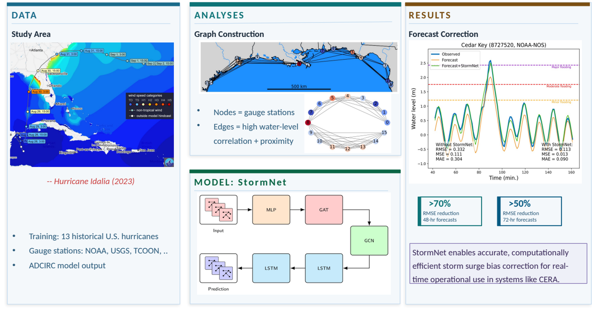

# StormNet

> A graph neural network framework for spatiotemporal bias correction of ADCIRC storm surge forecasts.


---

## Graphical Abstract

<p align="center">
  
</p>

---

## Overview

StormNet is a spatiotemporal graph neural network (GNN) framework for correcting water-level prediction biases in physics-based coastal ocean models. The framework combines:

- **Graph Convolutional Networks (GCN)**
- **Graph Attention Networks (GAT)**
- **Long Short-Term Memory (LSTM)** layers

to learn evolving spatial and temporal relationships among coastal tide-gauge stations.

The model is designed to improve storm surge forecasting by learning discrepancies between observed water levels and ADCIRC/STOFS predictions.

This repository contains the implementation used in the manuscript:

> **StormNet: A Spatiotemporal Graph Neural Network Framework for Bias Correction of ADCIRC Storm Surge Forecasts**

---

## Key Features

- Spatiotemporal graph learning for coastal water-level bias correction
- Dynamic correction of ADCIRC/STOFS model offsets
- Parallel treatment of multiple tide-gauge stations
- Graph construction based on inter-station correlations
- Hybrid GCN + GAT + LSTM architecture
- Evaluation on Hurricane Idalia (2023)

---

## Repository Structure

```text
.
├── main.py
├── loader/
├── models/
└── utils/
```

### Directory Description

| Directory | Description |
|---|---|
| `loader/` | Data loading and preprocessing utilities |
| `models/` | StormNet architecture and training routines |
| `utils/` | Auxiliary mathematical and utility functions |
| `main.py` | Main training/evaluation workflow and figure generation |

---

## Methodology

StormNet models storm surge prediction bias as a spatiotemporal learning problem over a coastal station network.

### Inputs

The framework uses:

- Historical ADCIRC/STOFS water-level offsets
- Tide gauge observations
- Spatial relationships between stations
- Sliding temporal windows

### Architecture

The model combines:

1. **GCN layers** to aggregate neighboring station information
2. **GAT layers** to learn adaptive spatial attention weights
3. **LSTM layers** to model temporal evolution

The learned offsets are then used to correct numerical storm surge forecasts.

---

## Data

The training dataset consists of historical hurricane events and associated:

- ADCIRC water-level predictions
- NOAA-NOS / USGS / USACE observations
- Precomputed water-level offsets

from https://historicalstorms.coastalrisk.live (cera.coastalrisk.live)

### Dataset Access

The processed dataset used in this work is available via Google Drive:

```text
https://drive.google.com/file/d/1P9wIcU8jkkljnswE0rx5_tiTrFW1X5c5/view?usp=drive_link
```

---

## Installation

### Recommended Environment

- Python >= 3.10
- PyTorch
- PyTorch Geometric
- CUDA optional (CPU execution supported)

> Note: PyTorch and PyTorch Geometric installation may depend on the local CUDA version. If installation fails, install `torch` and `torch-geometric` following the official instructions for your system, then install the remaining packages from `requirements.txt`.

### Clone Repository

```bash
git clone https://github.com/YOUR_USERNAME/StormNet.git
cd StormNet
```

### Install Dependencies

```bash
pip install -r requirements.txt
```

---

## Usage

### Run Training and Evaluation

```bash
python main.py
```

The script:

- Loads and preprocesses data
- Constructs the station graph
- Trains StormNet
- Evaluates predictions
- Generates figures and diagnostics

---

## Results

StormNet improves storm surge bias prediction accuracy relative to standalone sequential LSTM approaches while maintaining significantly reduced training time.

The framework demonstrates:

- Improved spatial consistency
- Enhanced temporal prediction capability
- Robust performance during extreme storm conditions
- Efficient graph-based learning across multiple stations

---

## Citation

If you use this repository in your work, please cite:

```bibtex
@article{Nader2026,
  title   = {StormNet: A Spatiotemporal Graph Neural Network Framework for Bias Correction of ADCIRC Storm Surge Forecasts},
  author  = {},
  journal = {},
  year    = {}
}
```

---

## License

This project is licensed under the terms of the license provided in this repository.

---

## Acknowledgements

This work uses:

- ADCIRC storm surge simulations
- NOAA-NOS, USGS, TCOON water-level observations
- PyTorch Geometric

We acknowledge all associated agencies and open-source contributors.

